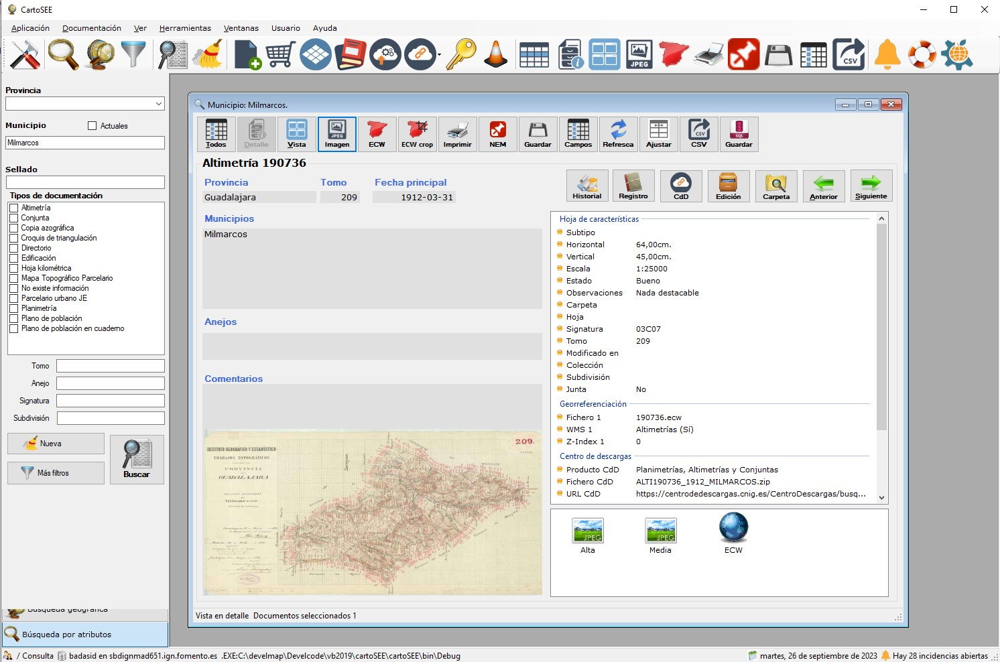

# CARTOSEE

  

<h1 align="center"><strong>CARTOSEE</strong> <small>Visualizador de la documentación del proyecto GEODOCAT</small></h1>

    
  
   
   
   
      
      
   

## 📚 Documentación

* Ayuda del Programa de gestión documental [🔗 enlace](documentacion/ayuda-cartosee.md)
* Situación  GEODOCAT en CdD [🔗 enlace](documentacion/info-cartoseecdd.md)
* Procedimiento de exportación del CartoSEE al CDD [🔗 enlace](documentacion/proc-cartosee-to-cdd.md)

