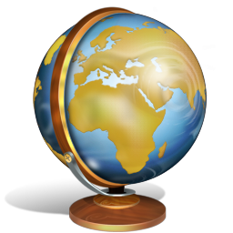

# CARTOSEE

Visualizador de la documentación del proyecto GEODOCAT. 

## Documentación

* Ayuda del Programa de gestión documental [🔗 enlace](documentacion/ayuda-cartosee.md)
* Situación  GEODOCAT en CdD [🔗 enlace](documentacion/info-cartoseecdd.md)
* Procedimiento de exportación del CartoSEE al CDD [🔗 enlace](documentacion/proc-cartosee-to-cdd.md)

