# Ayuda CartoSEE

## Introducción

El software CartoSEE permite la consulta de la información almacenada en formato digital, resultado de los trabajos de digitalización de la documentación almacenada en los archivos del Servicio de Documentación Geográfica y Biblioteca del Instituto Geográfico Nacional, IGN. Esta información comprende los siguientes tipos de documentos:

* Planimetrías.
* Altimetrías.
* Planos de Población.
* Planos de Edificación.
* Hojas kilométricas.
* Mosaicos digitales.

<figure>
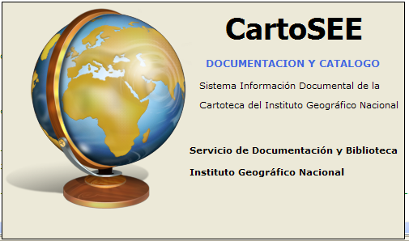
<figcaption>Bienvenida</figcaption>
</figure>

La documentación se encuentra en formato JPG para los documentos digitalizados y ECW para los documentos georreferenciados. Toda esta documentación se encuentra almacenada en un repositorio de información.

## Requisitos

* Sistema Operativo: Windows 7, Windows 10.
* Microsoft .NET Framework 4.7 o posterior.
* Driver de conexión PostgreSQL para .NET – Npgsql 2.0.11
* itextsharp.dll versión 5.
* Visor de archivos ECW para los documentos georreferenciados (Opcional para ver ECW)
* Software GIS para la visualización simultánea de diversos documentos (Opcional).

## Instalación

El software se distribuye mediante un archivo comprimido con la estructura de directorios necesaria para su funcionamiento. Posteriormente es necesario el asesoramiento del administrador del sistema para configurar el acceso a la base de datos y al repositorio de información.
Para desinstalar la aplicación , sólo es necesario borrar el directorio de la aplicación con todo su contenido.

## Descripción del Funcionamiento

Para el funcionamiento del programa es necesario el acceso al repositorio de la documentación digitalizada y a una base de datos PostgreSQL con la información recogida de cada documento. Esta base de datos dispone de una estructura determinada que el software reconoce como válida para su funcionamiento correcto.

Cuando el software se ejecuta por primera vez, si no dispone de los parámetros correctos para conectarse a la base de datos, arranca en modo Configuración. De esta manera podemos acceder a las Opciones de Configuración y configurar adecuadamente los parámetros.

El programa nos informa si tiene acceso a los documentos digitales. Si no dispone de acceso al repositorio con la documentación, el sistema sólo podrá realizar consultas sin información gráfica. Podemos configurar el acceso a los repositorios de información desde la ventana de opciones de configuración.

Los usuarios deben disponer de una cuenta de acceso al sistema. El usuario debe autenticarse antes de acceder al sistema. Sus permisos le otorgarán privilegios de sólo consulta o también de edición de la documentación. Opcionalmente puede configurarse un Acceso libre, disponible en la ventana de autenticación,   que permitirá el acceso a aquellas personas sin cuenta en el sistema.

<figure>

<figcaption>Autenticación</figcaption>
</figure>

Una vez ajustados los parámetros, reiniciaremos la aplicación y si la información configurada es correcta, la aplicación nos informará de que se encuentra lista para trabajar.

<figure>
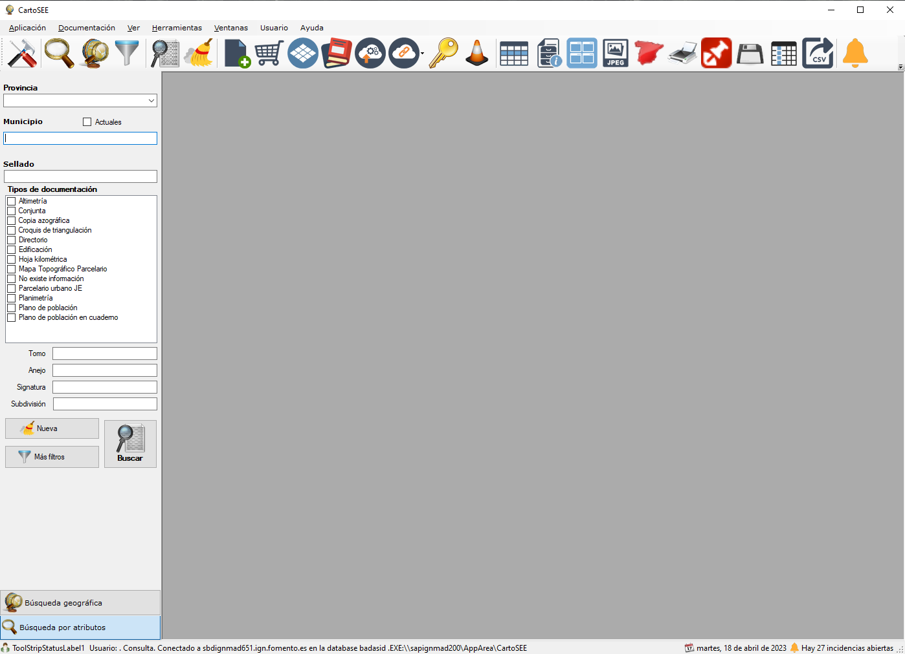
<figcaption>Ventana principal</figcaption>
</figure>

La pantalla principal se compone de una barra de menús, una barra de herramientas principal y un panel lateral que permite realizar las búsquedas de información. En la parte inferior el sistema informa de la conexión y del permiso del que dispone el usuario.

El software dispone una barra de menús y de una barra de botones desde donde se pueden lanzar las herramientas de consulta. Situando el cursor sobre los botones, podemos ver una pequeña descripción de la funcionalidad.

<figure>
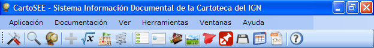
<figcaption>Funciones de la barra de herramientas</figcaption>
</figure>

Funciones de la barra de herramientas

* Panel de Configuración
* Búsqueda de documentación por atributos
* Búsqueda geográfica de documentación
* Opciones de filtro
* Ejecutar consulta
* Limpiar campos
* Crear nuevo documento en SIDCARTO
* Carro de la compra
* Visor de mosaicos digitales
* Libros de registro del Archivo Topográfico
* Proceso exportación para el Centro de descargas
* Generador de enlaces al Centro de descargas
* Gestión de usuarios
* Desarrollo
* Resultados 👉 Ver lista completa de resultados
* Resultados 👉 Ver detalles de los resultados
* Resultados 👉 Ver miniaturas del documento
* Resultados 👉 Ver imagen digitalizada del documento
* Resultados 👉 Ver documento georreferenciado.
* Resultados 👉 Generar metadatos
* Resultados 👉 Vista previa para imprimir los resultados
* Resultados 👉 Generar metadatos 
* Resultados 👉 Descargar los documentos seleccionados
* Resultados 👉 Seleccionar columnas visibles
* Resultados 👉 Exportar lista de resultados a CSV
* Notificar incidencia
* Acerca de...

En la parte izquierda se encuentra un panel vertical con las herramientas de consulta, desde donde podremos realizar consultas alfanuméricas y geográficas sobre la información almacenada en la base de datos.
 
## Opciones de Configuración

Desde esta ventana podemos establecer los parámetros de configuración para el correcto funcionamiento de la aplicación:

* **Configuración de herramientas**: Localización de los programas que se utilizarán para visualizar la documentación digitalizada. Por defecto utiliza los predefinidos por el sistema operativo. También podemos especificar un programa en concreto para las labores de impresión. Si se utiliza un visor GIS, aquí se puede configurar una plantilla de carga de datos. Por ahora sólo está soportado el software Global Mapper.
* **Repositorios y ficheros de configuración**: Localización de los directorios que contienen los documentos digitalizados. Una vez seleccionado el directorio, la aplicación nos advierte si el directorio existe. El sistema permite configurar opcionalmente un repositorio. También podemos configurar qué imagen deseamos visualizar por defecto, la imagen a máxima calidad más pesada, o a calidad normal, aconsejable para equipos menos potentes o en caso de saturación en la red. Desde esta ventana también se configuran otros dos parámetros:
  * *Base para el visor de cartografía*:  permite configurar la ubicación de un mapa raster que utiliza como mapa de fondo el visor de cartografía para localizar documentación dentro de un ámbito geográfico.
  * *Rejilla para conversiones*: ubicación de la rejilla en formato NTv2 utilizada para la transformación de coordenadas entre ERTS89 y ED50.
* **Conexión a la base de datos**: Parámetros de conexión a la base de datos. Para que tengan efecto estos cambios es necesario reiniciar la aplicación.
* **Metadatos**: ubicación de las plantillas para la generación de los metadatos para cada tipo de documentación. Es necesario indicar la ruta de la plantilla para cada tipo de documentación.

## Consulta de información

El programa dispone de dos modos de consulta para localizar la información:

**Búsqueda por Atributos:** permite filtrar cualquiera de los atributos disponibles para cada documento: municipio actual o histórico, dimensiones, tipo de documento, estado de conservación, observaciones…

**Búsqueda Geográfica:** permite localizar toda la información asociada consultando los mosaicos de las hojas kilométricas georreferenciadas. Además permite superponer la capa de Catastro, la Primera Edición de MTN50 y la BCN25.

En la barra superior se encuentra unos botones que permiten lanzar los visores de cada uno de los tipos de documentación almacenada.

### Búsqueda por Atributos

Cada documento se encuentra almacenado en el sistema junto con una serie de atributos que describen su contenido. Podemos realizar consultas por los siguientes atributos asociados a cada documento:

* Provincia
* Municipio.
* Signatura
* Dimensiones.
* Número de sellado
* Colección
* Tipo de documento.
* Estado de conservación
* Fechas
* Notas, observaciones o palabra clave
* Superficies

Una vez definida nuestra consulta, pulsamos el botón de Buscar   y aparecerá una ventana con los resultados que satisfagan nuestros criterios de búsqueda.

Al introducir el nombre del municipio, el sistema mostrará dinámicamente aquellos elementos de la lista de municipios históricos que satisfagan el criterio de búsqueda, permitiendo localizar nombres cuya grafía no conocemos completamente. Sobre la lista podemos elegir la opción deseada haciendo doble clic sobre el nombre. 

Si previamente hemos seleccionado una Provincia, se mostrarán exclusivamente los municipios de esta provincia.  Si marcamos la casilla Actuales, en la lista de municipios aparecerán sólo aquellos que existan actualmente. Por último, introduciendo un número de sellado en el cuadro de municipios, el sistema lo interpretará como un número de sellado, y mostrará el correspondiente documento.

### Búsqueda geográfica

Toda la documentación de cartoteca se encuentra georreferenciada sobre cartografía del MTN25 en EPSG:23030. Por tanto podemos hacer consultas de carácter geográfico, obteniendo los documentos que describen los lugares que geométricamente podemos definir.

<figure>
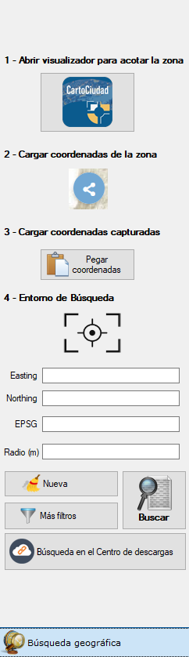
<figcaption>Búsqueda geográfica</figcaption>
</figure>

La ventana de búsquedas geográficas permite definir el entorno en el cual se realizará la búsqueda, mediante las coordenadas máximas y mínimas o mediante una coordenada y un radio. Las coordenadas pueden introducirse en geográficas sobre WGS84 o en UTM Huso 30 extendido sobre ED50. El radio se mide en kilómetros.
Opcionalmente podemos definir la zona que queremos consultar utilizando un visor cartográfico, que utilizará como mapa base el raster que hayamos definido previamente en la pantalla de configuración.
En la barra de herramientas disponemos también de una calculadora geodésica, que nos permite trabajar con coordenadas en otros husos del territorio español,  realizando previamente la conversión con su ayuda.

Cuando se realizaron los procesos de georreferenciación de los documentos del Archivo documental, se definieron vectorialmente unas zonas que encierran la parte del documento que contiene la cartografía, separándola del resto de la información marginal.

<figure>
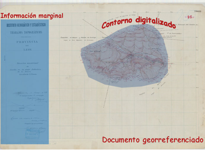
<figcaption>Vectorización documento georreferenciado</figcaption>
</figure>

De esta manera, podemos comprobar si dada una coordenada, esta se encuentra dentro del documento sólo o si además se encuentra en una zona donde hay cartografía definida. Esto nos permite obtener resultados más precisos.

## Panel de resultados

Cuando se realiza una búsqueda, aparece una ventana con el resultado de nuestra consulta. La ventana permite ver toda la documentación que satisface los criterios de la búsqueda. Haciendo doble clic sobre cada uno de los resultados podemos acceder a la información pormenorizada del documento. Si dispone de información digitalizada, desde aquí también podemos lanzar el documento digital.
Por cada consulta que hagamos aparecerá una ventana de resultados. Desde el menú Ventana podemos gestionar nuestras ventanas de resultados.

 

<figure>
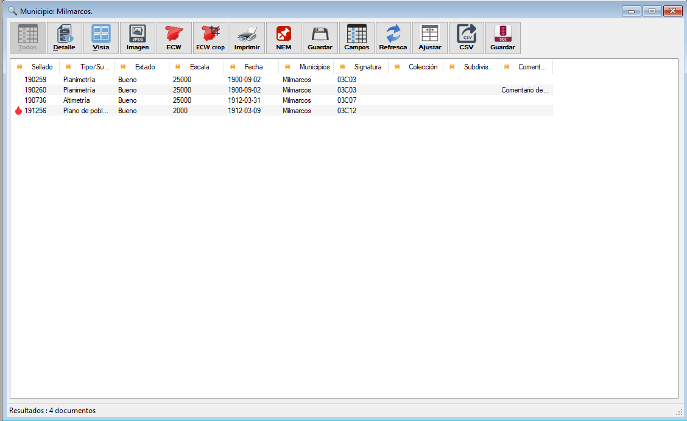
<figcaption>Panel de resultados</figcaption>
</figure>

La ventana de resultados dispone de tres vistas: una en la que muestra todos los resultados tabulados de la consulta,  otra vista en la que muestra para un determinado documento el valor de todos sus atributos y una vista de miniaturas en la que aparecen si están disponibles una pequeña reproducción del documento. En la parte inferior tenemos información del número de resultados obtenidos y el de documentos seleccionados. 
Desde la ventana de resultados el programa puede realizar diversas funciones: 

* Visualizar imagen escaneada.
* Visualizar imagen georreferenciada.
* Visualizar imagen georreferenciada sobre GIS. (Actualmente sobre GM).
* Imprimir resultado de la consulta.
* Generar metadatos de los documentos seleccionados.
* Exportar documentos a una carpeta.
* Seleccionar las columnas visibles en la ventana de resultados.
* Actualizar consulta.
* Exportar resultados a formato CSV.
* Añadir elementos seleccionados al carrito.

En ocasiones  es necesario realizar varias búsquedas con criterios muy distintos, como por ejemplo combinando resultados de varios municipios distintos. En esos casos podemos utilizar el botón del carro de la compra para añadir todos o algunos de los resultados de cada consulta a un panel de resultados global (el carro de la compra), desde el que podremos realizar con posterioridad todas las operaciones. Visualización, impresión de metadatos, exportación…

Podemos configurar un visor GIS externo, de modo que en el caso de que un documento tenga varios documentos georreferenciados, podamos abrirlos todos conjuntamente. Actualmente el sistema está preparado para trabajar con Global Mapper. Esta acción se activa automáticamente al seleccionar varios documentos a la vez o al seleccionar uno que tenga varios documentos asociados.

Desde el menú Documentación → Resultado de la consulta, podemos acceder a las funciones presentes en el Panel de Resultados y a otras funciones extras.

La vista de detalle ofrece la información de todos los atributos disponibles del documento seleccionado. También podemos ver la documentación ráster, JPG y ECW, que se dispone del documento.

 

<figure>
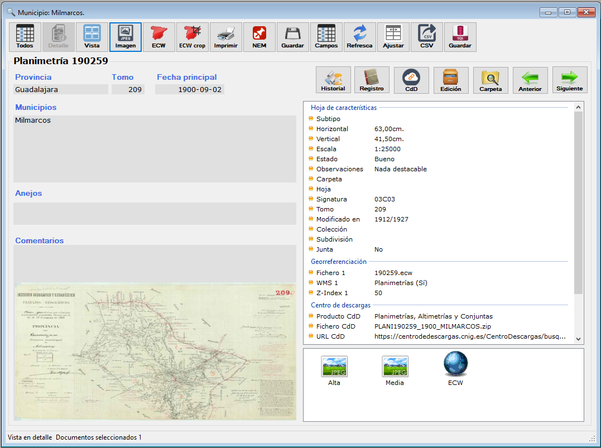
<figcaption>Vista de detalle</figcaption>
</figure>

Si en la parte inferior derecha las imágenes aparecen en color rojo, significa que no son accesibles, y que deberemos configurar nuestro repositorio de imágenes desde el panel de control. Desde esta ventana también podemos arrastrar los resultados sobre un programa de consulta que admita funciones de Drag&Drop.

Si disponemos de permisos de edición, también podemos editar los atributos del documento o consultar directamente la carpeta donde están almacenadas las imágenes. Con las flechas de la parte superior derecha, podremos desplazarnos entre registros.

Por último desde la ventana de miniaturas podemos acceder a una pequeña reproducción del documento, que nos puede ayudar a identificarlo de un vistazo en ciertas búsquedas. Al hacer doble clic sobre una miniatura, aparecerán los atributos del documento.

 

<figure>
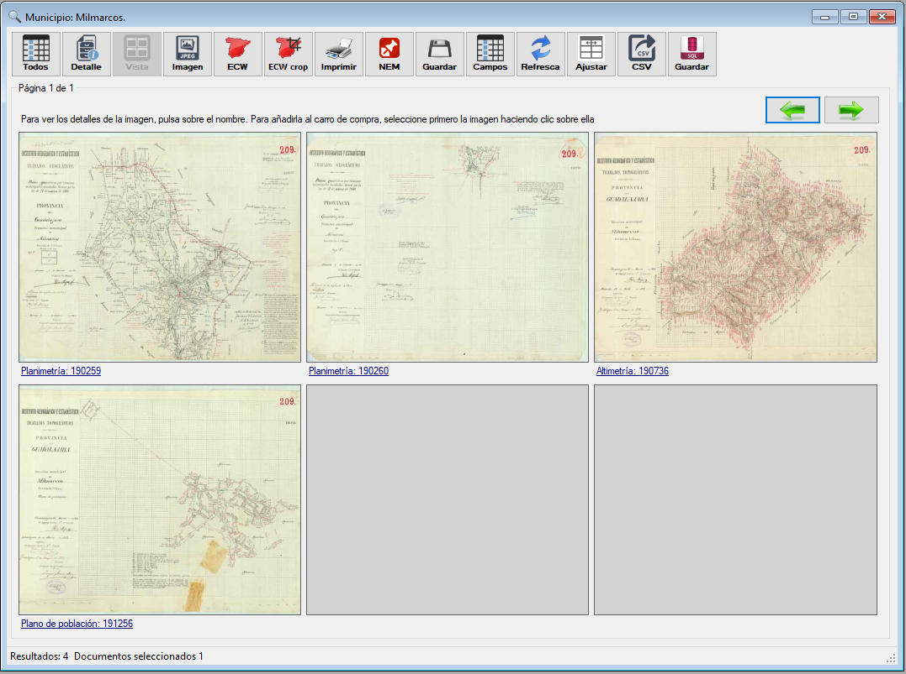
<figcaption>Vista de miniaturas</figcaption>
</figure>

## Informes

Los informes difieren de las consultas en que el resultado no corresponde siempre a documentos, sino que incluye resúmenes y estadísticas. Actualmente los informes disponibles son:

* Inventario de GEODOCAT clasificado por Provincia y tipo de documento.
* Inventario de GEODOCAT clasificado por Provincia y estado de conservación.
* Últimos números de sellado asignados por provincia.

 

<figure>
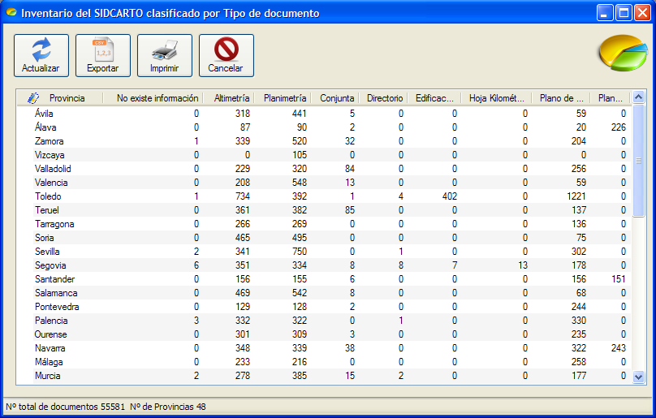
<figcaption>Inventario</figcaption>
</figure>

 
## Herramientas de productividad

CartoSEE proporciona herramientas de productividad que permiten acelerar algunos procesos de carga y consulta.

### Visor de mosaicos digitales

Como resultado de los procesos de georreferenciación, se han obtenido un nuevo tipo de documentos presentes en GEODOCAT denominados mosaicos digitales. Los mosaicos digitales están formados por la unión de varios documentos individuales en uno sólo, que nos ofrece un mosaico global con toda la información. Para construír un mosaico se han realizado diversas funciones individualmente para cada documento georreferenciado, como son el recorte de la información marginal, el mosaicado y la generación de un fichero único. 
El Visor de mosaicos digitales permite consultar los mosaicos disponibles, visualizarlos y conocer a partir de qué documentos individuales se ha construido.

 

<figure>
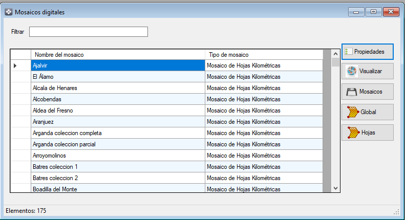
<figcaption>Inventario</figcaption>
</figure>

### Incidencias  

Desde el menú de usuario podemos notificar incidencias respecto al estado o la calidad de los documentos almacenados en el BADASID. Si algún documento presenta una georreferenciación errónea o un fallo en sus atributos, podemos notificarlo mediante esta herramienta.

En el registro de la incidencia aparecerá nuestro nombre de usuario, de manera que el administrador del sistema podrá ponerse en contacto con nosotros una vez la incidencia haya sido corregida.

 

<figure>
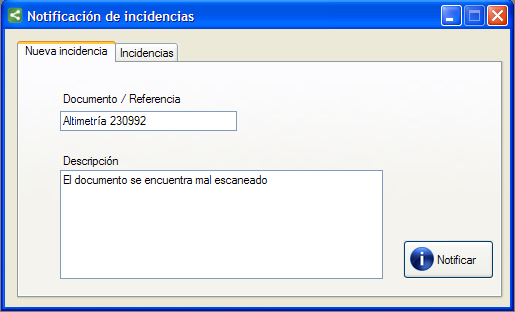
<figcaption>Inventario</figcaption>
</figure>

 
### Edición de documentos  

La herramienta de edición permite modificar los atributos de los documentos almacenados en GEODOCAT, así como incorporar nuevos documentos al Sistema de información documental.

Simplemente deberemos rellenar todos atributos solicitados. Si alguno de ellos se rellenara con un valor erróneo, el sistema nos advertirá para que procedamos a corregirlo. Después en la pestaña de Imágenes, podemos seleccionar las imágenes escaneadas del documento, si queremos que el programa se ocupe de situarlas en el repositorio. Podemos optar por hacerlo nosotros manualmente después, para lo cual marcaremos la opción de *No Agregar información gráfica*.

 

<figure>
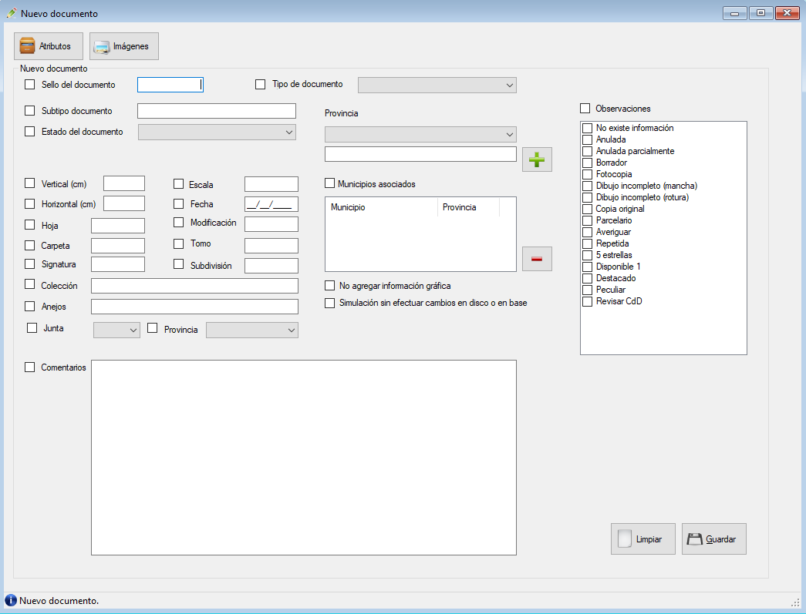
<figcaption>Inventario</figcaption>
</figure>

Si estamos dando de alta varios documentos y en muchos casos los atributos se repiten, podemos marcar el campo que deseamos mantener entre edición y edición, y una vez guardado el documento los valores se mantendrán listos para añadírselos al siguiente documento, limpiándose los valores de los restantes campos.

La edición de documentos dispone de interfaz muy similar, sólo que en este caso deberemos marcar aquellos campos que queremos modificar.  Marcaremos el campo y añadiremos el nuevo valor del atributo. Sólo se cambiarán aquellos valores cuyas propiedades estén marcadas.

Por último, podemos realizar una edición en lote y cambiar múltiples documentos. Para ellos desde el resultado de una consulta cualquiera, seleccionamos los documentos que queremos cambiar y con el botón derecho del ratón sobre la selección elegimos la opción Edición en lote.

 

<figure>

<figcaption>Edición en lote</figcaption>
</figure>

## Anexo I: Repositorio de documentación

En el Servidor del BADASID se encuentra el repositorio con toda la documentación almacenada en los diferentes Sistemas de Información.
El repositorio es la estructura de directorios que almacena de forma organizada toda la información digitalizada del proyecto. El repositorio utiliza como soporte físico un disco duro externo con conexión USB o una carpeta de red compartida.

La estructura de ficheros está formada en un primer nivel por el tipo de documento que almacena, y en sucesivos niveles por una estructura de códigos de provincia y municipio que el software de consulta es capaz de interpretar en función de los atributos del documento para obtener la información digitalizada.

 

<figure>
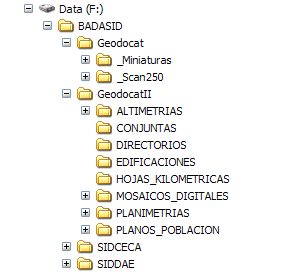
<figcaption>Edición en lote</figcaption>
</figure>

