# SIGLIM

## Introducción

SIGLIM almacena la geometría correspondiente al Registro de Líneas Límite en dos tablas fundamentales.

* **Limtram**: almacena tramos de línea límite. Los tramos son geometrías SIMPLE LINESTRING, y deslindan dos territorios, uno a cada lado.
* **Centroides**: almacena una geometría de tipo SIMPLE POINT que representa a cada uno de los territorios deslindados por una línea límite. 

El resto de las entidades geométricas almacenadas en SIGLIM, recintos municipales, provinciales, autonómicos, tablas compatibles con la directiva INSPIRE, se generan a partir de estas dos tablas fundamentales.

Los procesos de edición están por lo tanto enfocados a la modificación de las entidades lineales de la tabla Limtram y las entidades puntuales de la tabla Centroides, y una vez realizados los cambios mediante una serie de procesos, automáticos y manuales, el resto de la información geométrica puede ser generada.

Las tablas Limtram y centroides almacenan información vigente e histórica, de manera que toda geometría que se incorpora a SIGLIM lo hace con una determinada fecha de  alta. Toda geometría eliminada de SIGLIM, no es borrada realmente sino marcada como archivada mediante la inserción de su correspondiente fecha de baja. De esta manera se conservan los datos archivados que pasan a ser históricos y están disponibles para compararlos con sus homólogos vigentes.

La edición de una serie de geometrías consiste por tanto en identificar cuáles hay que archivar y cuales hay que incorporar. Se pueden hacer tres operaciones con las entidades geométricas.

* **Archivar**: una geometría pasa a ser histórica, a tener fecha de baja no nula. Conserva todos sus atributos.
* **Crear**: se incorpora una geometría a SIGLIM, con una determinada fecha de alta. Sus atributos son, o bien calculados por procesos automáticos, o bien notificados al sistema mediante un diccionario de clases. 
* **Modificar**: una entidad geométrica es modificada en su geometría. Este proceso internamente se descompone en un proceso de archivado de la entidad original y en un proceso de creación de una nueva entidad, con una nueva geometría pero heredando los atributos de la entidad archivada.

### Topología

La geometría en la tabla Limtram debe ser topológicamente correcta, de manera que siempre se puedan realizar procesos de recintado con la información vigente:

* Sin overlapping con otras entidades o consigo misma
* Sin nodos colgantes o dangles
* No están permitidas las intersecciones consigo misma
* No están permitidas las intersecciones con otras entidades sin generar nodo
* Las entidades deben ser simples

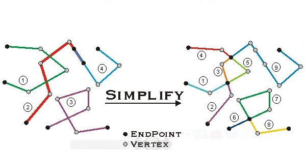

## Gestión documental

SIDDES permite la consulta de la información relativa a la documentación técnica y jurídica que respalda la geometría de líneas límites inscrita en el Registro Central de Cartografía. Parte de esta documentación corresponde al resultado de los procesos de digitalización de la documentación almacenada en el Servicio de Delimitaciones Territoriales, formada por los siguientes documentos:

* Correspondencia del Servicio: entradas y salidas
* Informes de replanteo y expedientes de deslinde
* Citaciones
* Inventario de Legajos
* Cuadernos de Coordenadas de Madrid.
* Resoluciones y sentencias

De todos estos documentos, los únicos que no disponen de la información digital son los llamados Legajos.

### Funcionamiento

Para el funcionamiento del programa es necesario el acceso al repositorio de la documentación digitalizada y a una base de datos PostgreSQL con la información recogida de cada documento. Esta base de datos dispone de una estructura determinada que el software reconoce como válida para su funcionamiento correcto.

Cuando el software se ejecuta por primera vez, si no dispone de los parámetros correctos para conectarse a la base de datos, arranca en modo Configuración. De esta manera podemos acceder a las Opciones de Configuración y configurar adecuadamente los parámetros.

El programa nos informa si tiene acceso a los documentos digitales. Si no dispone de acceso al repositorio con la documentación, el sistema sólo podrá realizar consultas sin información gráfica. Podemos configurar el acceso a los repositorios de información desde la ventana de opciones de configuración.

Los usuarios deben disponer de una cuanta de acceso al sistema. El usuario debe autenticarse antes de acceder al sistema. Sus permisos le otorgarán privilegios de sólo consulta o también de edición de la documentación. Opcionalmente puede configurarse un Acceso libre, disponible en la ventana de autenticación,   que permitirá el acceso a aquellas personas sin cuenta en el sistema.

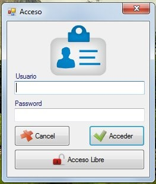

#### Búsqueda de información

Una vez ajustados los parámetros, reiniciaremos la aplicación y si la información configurada es correcta, la aplicación nos informará de que se encuentra lista para trabajar.

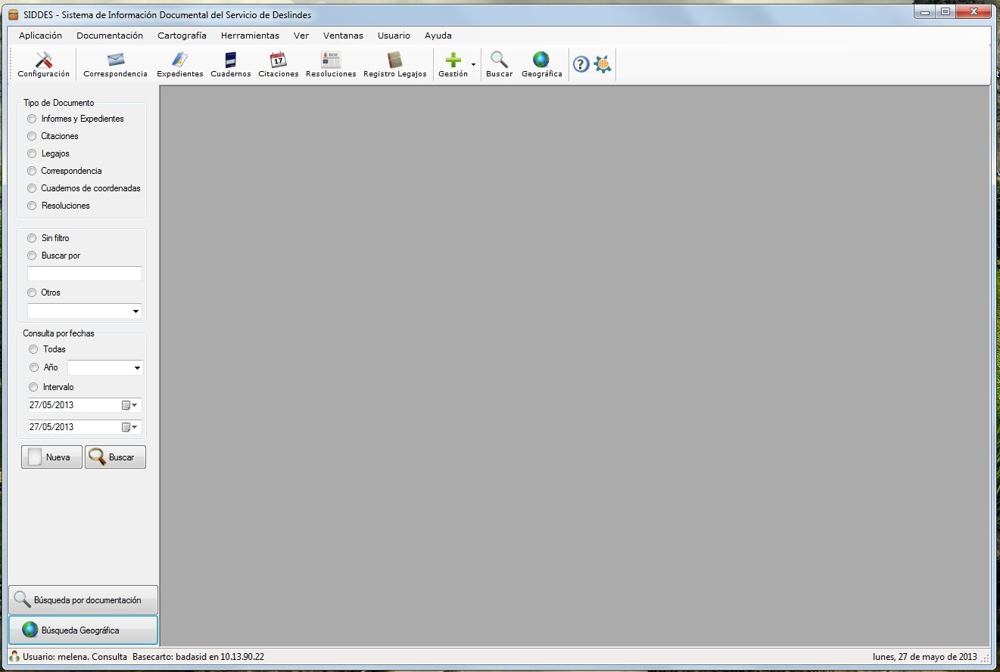

En la parte superior podemos ver una barra de herramientas que nos da acceso a los diferentes tipos de documentación almacenados en SIDLIM. También, si disponemos permiso para ello, tenemos una serie de herramientas que nos permitirán incorporar nueva documentación al sistema.

Si hacemos clic en cualquiera de los botones de la barra de herramientas nos aparecerá en pantalla toda la documentación relativa a ese tipo de documento: correspondencias, legajos, informes de expediente…

En la parte derecha, tenemos un panel en el que podemos buscar dentro de un determinado tipo de documentación. Podemos aplicar diversos filtros de fechas, tipología de documentación o buscar por un determinado concepto introducido en las observaciones.

#### Búsquedas geográficas

La búsqueda geográfica permite localizar toda la información disponible de una línea límite. Esta información comprende:

* Correspondencias recibidas o emitidas con los ayuntamientos implicados en el deslinde
* Expedientes de deslinde e informes de replanteo relacionados con la línea límite
* Citaciones enviadas a cualquiera de los dos ayuntamientos
* Cuadernos y reseñas de coordenadas
* Resoluciones, decretos y sentencias que recogen información sobre el deslinde
* Actas de deslinde y cuadernos de campo de SIDDAE
* Planimetrías  y altimetrías que recogen la totalidad o una parte de la línea límite

Accedemos a la Búsqueda geográfica desde el botón de la barra de herramientas, el botón en la parte inferior de la barra lateral o desde el menú  Documentación → Buscador geográfico. Aparecerá una ventana emergente en al que podemos seleccionar los dos  territorios cuya información queremos consultar

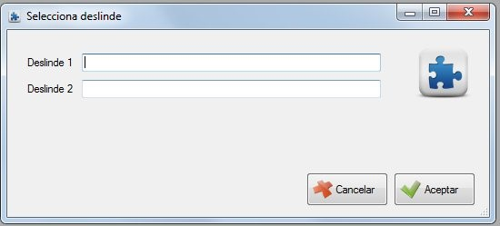

Una vez seleccionado el deslinde el sistema comenzará una búsqueda en los diferentes sistemas de información documental recabando toda la información técnica y jurídica relativa al deslinde. La información encontrada se mostrará en pantalla.

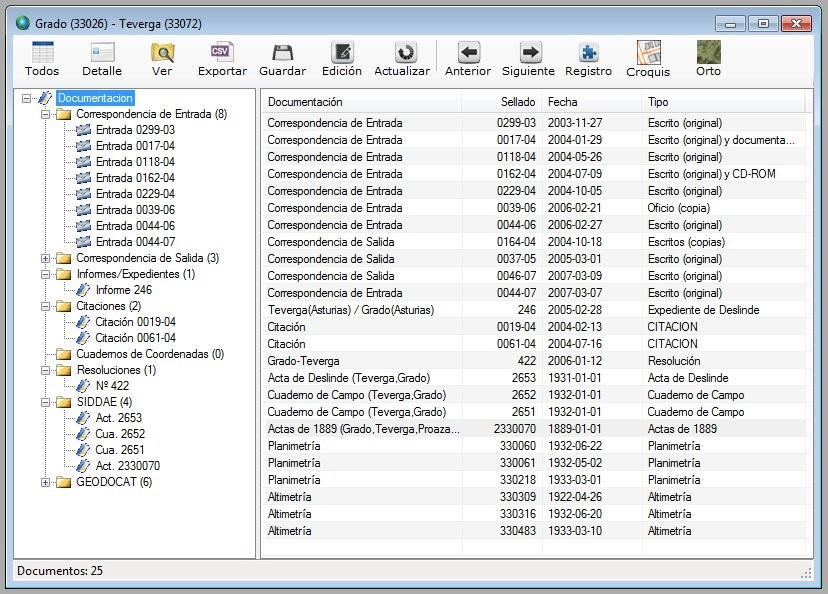

En la parte derecha se muestra un esquema en árbol de la tipología número de los documentos  asociados al deslinde. En la parte derecha se muestra un esquema más detallado de los documentos. Pulsando sobre los encabezados podemos ordenar los resultados encontrados, así como establecer la cronología del historial de toda la documentación de la línea.

Haciendo doble clic sobre los elementos de la izquierda veremos un detalle de la información, observaciones y comentarios. Podemos también acceder a la información gráfica del documento almacenada en el sistema: documentos PDF, planos georreferenciados en ECW y mapas escaneados en JPG.

Si disponemos de los correspondientes permisos de edición, podemos editar el documento, añadiendo o corrigiendo sus atributos.

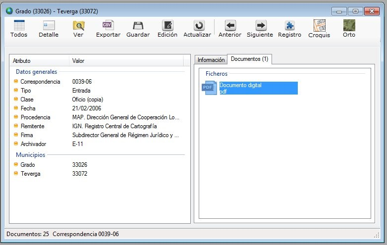

Otras funciones disponibles son la exportación de los resultados como un informe en formato texto o la exportación de los documentos asociados a una carpeta.

En la parte superior encontraremos botones que nos permiten realizar estas funciones.  Entre ellas está la generación de un croquis conteniendo la geometría de la línea, una ortofoto de la zona por la que transcurre la línea límite y la hoja registral.

#### Hoja registral

La Hoja registral es un documento oficial recogido en el real Decreto 1545/2007 en el cual se describe geométricamente la línea límite y se citan las fuentes documentales, técnicas y jurídicas, sobre las que se sustenta. 

Recoge también otros aspectos tales como la calidad geométrica de la línea, la existencia o no de provisionalidades en su trazado, situación de los mojones que la definen y elementos geográficos que describen su trazado.

#### Gestión de la correspondencia

La aplicación SIDLIM dispone de una herramienta para el alta de nueva correspondencia en el sistema. Para acceder al interfaz de alta seguimos la secuencia 

Menú Documentación ➡ Gestión de Documentos ➡ Correspondencia

o bien accedemos directamente mediante el botón de la barra de herramientas.

La ventana emergente nos permite introducir los atributos de la correspondencia que queremos incorporar al sistema de información documental.

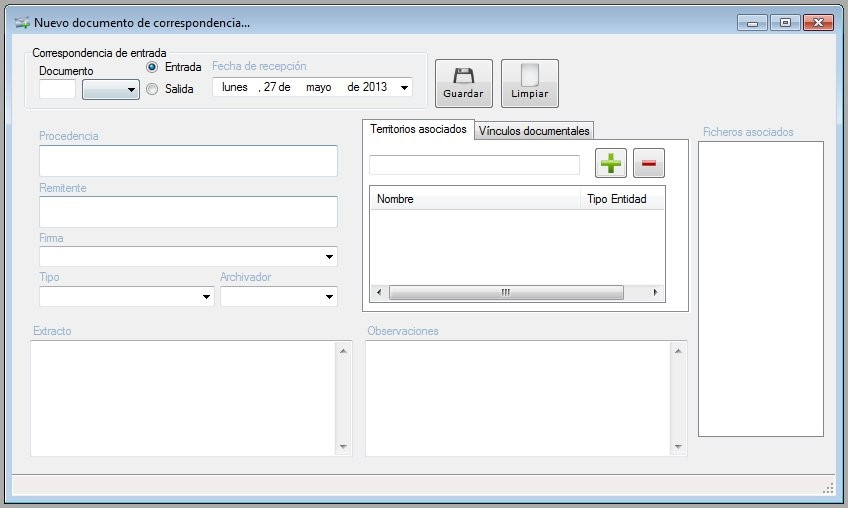

El sistema permite la introducción de los siguientes atributos:

* Nº de sellado, clase (recibida o enviada) y fecha.
* Sección de RCC al que se asigna la correspondencia, responsable de su gestión
* Procedencia o destino.
* Remitente o destinatario.
* Tipo y archivador donde se encuentra físicamente el documento.
* Extracto y observaciones.
* Vínculos geográficos: municipios o territorios a los que hace referencia.
* Vínculos documentales: documentos previamente archivados relacionados.
* Ficheros digitales: contienen  los documentos escaneados.

El número de documento está formado únicamente por un valor numérico, salvo en los casos en los que se trate de documentación adjunta.  En estas situaciones, el número de documento estará formado por un valor numérico seguido de un guión y el sufijo BIS, TRIS, 4BIS ó 5BIS. En las nuevas documentaciones, está nomenclatura se ha cambiado por A01, A02, A03,...

Para introducir vínculo geográfico, basta con introducir en el cuadro de texto algunas letras que componen el nombre. La aplicación sugerirá algunas posibilidades que coinciden con las palabras introducidas. Seleccionamos el nombre haciendo clic con el ratón sobre el nombre. Para vincularlo al documento pulsamos en el botón de añadir ➕ . Si por el contrario queremos desvincular una entidad geográfica, basta con seleccionarlo y pulsar en el botón eliminar ➖.

Para introducir vínculos con otros documentos hay que introducir el número de sellado junto con el año, como por ejemplo 125-07, y después seleccionar del cuadro desplegable el tipo de documento: citación, correspondencia de entrada o correspondencia de salida. Después pulsamos el botón de añadir ➕.

La aplicación validará si la información introducida corresponde con algún documento almacenado, y si es así, lo añadirá a la lista. Si no, nos informará mediante un mensaje de advertencia. El documento no podrá ser vinculado. Para desvincular, pulsaremos el botón ➖ y el documento desaparecerá.

Una vez que los datos hayan sido introducidos, puede seleccionarse, opcionalmente, los documentos digitalizados que contienen una copia digital del documento. Para ello utilizamos arrastramos sobre el cuadro con la etiqueta Ficheros asociados, cualquier documento con extensiones PDF, DOC, JPG, ECW. Si es necesario introducir otro tipo de documentos, pueden comprimirse en un fichero ZIP y agregarse después el archivo comprimido. Si queremos eliminar un documento agregado, lo seleccionamos y pulsamos la tecla  Backspace, 🔙.

Por último, pulsamos el botón de Guardar. Los datos serán validados y el nuevo registro de correspondencia será creado. Para ello el usuario debe disponer de permisos de escritura en la base de datos y en la carpeta del repositorio donde se encuentran almacenados los documentos digitales.

#### Gestión de la restante documentación

La aplicación SIDLIM dispone de una herramienta para el alta de nuevos informes, expedientes y cuadernos de coordenadas en el sistema. Para acceder al interfaz de alta seguimos la secuencia, según el caso: 

* Menú Documentación ➡ Gestión de Documentos ➡ Informes y Expedientes
* Menú Documentación ➡ Gestión de Documentos ➡ Cuadernos de Coordenadas
* Menú Documentación ➡ Gestión de Documentos ➡ Resoluciones y sentencias

o bien accedemos directamente mediante el botón correspondiente de la barra de herramientas.

La ventana emergente nos permite introducir los atributos del documento, así como asociarles documentos digitales con la información de los mismos. Al ser documentos referentes a una línea límite, estos documentos deben llevar como atributo obligatorio los dos municipios deslindados.

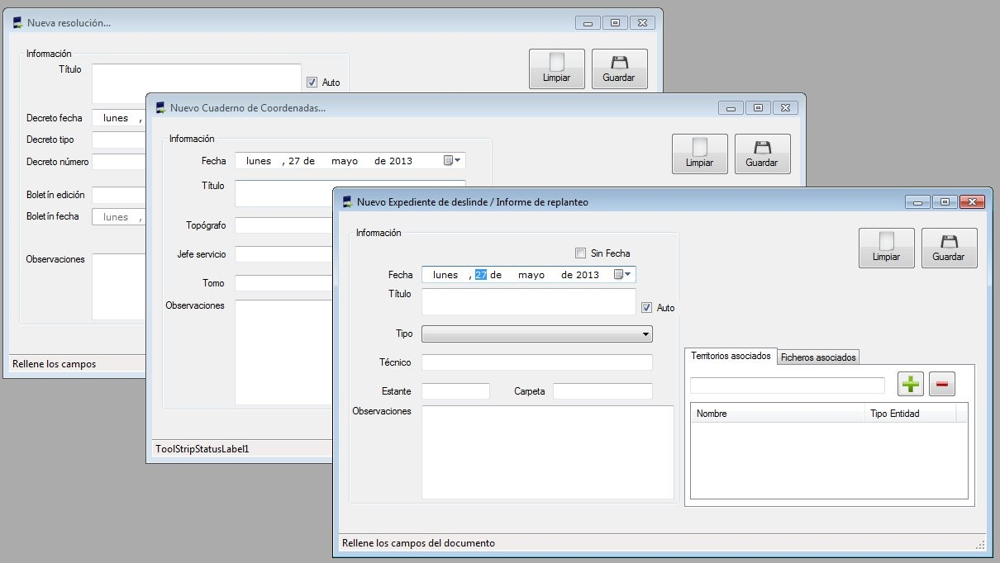

Según la tipología del documento deberemos rellenar unos u otros atributos. La información se almacenará en la base de datos y los documentos digitales se guardarán en el repositorio.

La metodología para digitalizar estos documentos debe ser similar a la utilizada con la correspondencia. Se aconseja escanear esta documentación con los mismos parámetros de digitalización que los utilizados en los documentos de correspondencia. La estructura de directorios también debe ser similar.

### Consultas de cartografía

Podemos consultar la información sobre las geometrías que tenemos almacenadas en la base de datos. 

#### Centroides

Desde el menú Cartografía ➡ Centroides de deslinde podemos consultar la información de los centroides. Desde esta ventana podemos consultar los atributos asociados a cada uno de los centroides. Podemos modificar el nombre de los centroides cuyo tipo sea exclave o pertenencia, así como modificar las coordenadas. Cuando se introduzcan coordenadas, estas deben darse en geográficas sobre el sistema de referencia ETRS89. El sistema comprobará que las coordenadas sean válidas para el territorio español.

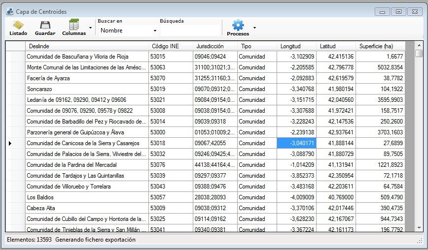

Desde aquí podemos generar una certificación de superficie del territorio en el que se encuentra el centroide.

#### Tramos vigentes de líneas límite

Desde el menú Cartografía ➡ Tramos vigentes de líneas límite podemos consultar la información de la geometría de las líneas límite y sus atributos. Podemos modificar la información de su estado de provisionalidad, describir el tipo de provisionalidad existente o modificar la calidad geométrica del tramo.

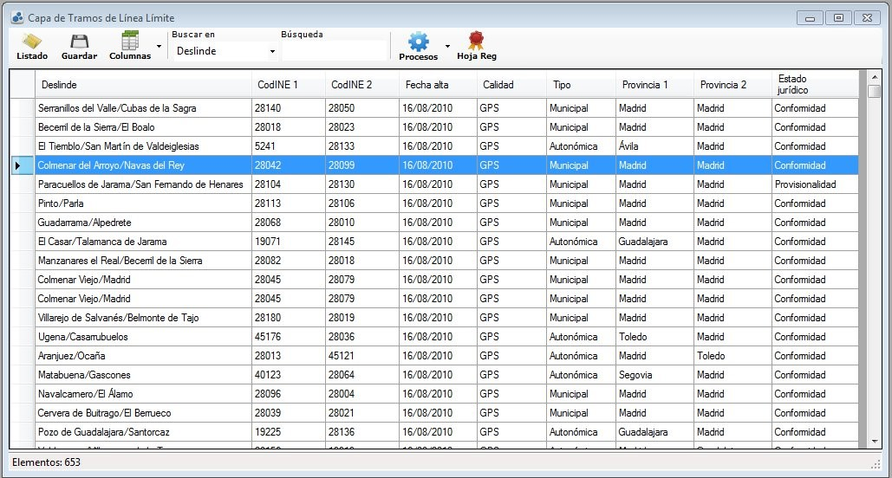

Podemos consultar la hoja registral asociada a la línea límite, o la información almacena en SIDDES relacionada con la línea límite.

Desde aquí también podemos generar  una hoja registral de una o varias líneas. Para ello seleccionamos las líneas y desde el botón de procesos Generación de hoja registral → Generar hoja registral. 
Las hojas registrales se almacenan en una estructura de directorios situada en \\sbdignmad800\recursos\HR 
 
Dentro de este directorio las hojas registrales se encuentran almacenadas por  provincia (a la que pertenece el  primer territorio citado en el deslinde) y dentro de cada provincia por matrícula. Dentro del directorio de cada matrícula se encuentra una imagen PNG con el croquis de la línea límite, una imagen JPG con la imagen del PNOA cubierta por el croquis y el PDF con la hoja registral.

Cuando desde SIDDES se genera una hoja registral, se realizan peticiones al servidor del PNOA y al servidor de líneas límite para obtener las imágenes que componen la hoja registral. Una vez descargadas, se elabora la hoja a partir de los atributos disponibles de la línea límite.

### Generación de certificaciones de superficie

Uno de los cometidos del Servicio de Delimitaciones territoriales es la generación de certificaciones de superficie de los municipios que han sufrido cambios en alguna de sus líneas límite.

Las certificaciones de superficie constan de un documento en tamaño DIN A3 que presenta un mapa del término municipal del municipio rodeado de los territorios circundantes. El documento se muestra a una escala lo suficientemente grande como para contener la extensión total del término municipal, pertenencias incluidas. La proyección en la que se encuentra la cartografía es UTM y el sistema de referencia ETRS89.

En la parte inferior del documento aparece el nombre oficial del municipio, su código INE y su provincia. Se muestra también la escala a la que se representa el mapa. Debajo se muestra la superficie en kilómetros cuadrados con dos decimales calculado mediante la  proyección de  la geometría sobre Lambert Azimutal Equivalente. La superficie es la suma del área de todos los territorios bajo jurisdicción única del municipio.

Por último aparece una lista con los municipios y comunidades jurisdiccionales colindantes, con su provincia en el caso de que sea distinta a la del municipio para el que se genera la certificación. Se muestra su nombre y su código INE si dispusiera de uno. En la parte derecha aparece el texto de la certificación y la firma del responsable.

La certificación se genera en formato PDF y la imagen con el mapa se obtiene mediante la consulta a un WMS que toma los datos directamente de SIGLIM. Podemos configurar la URL del servicio WMS que genera el mapa desde la ventana de Configuración ➡ Herramientas ➡ Pestaña de certificaciones. En este apartado podemos configurar también el texto oficial que acompaña a la certificación y los datos del responsable de la firma.

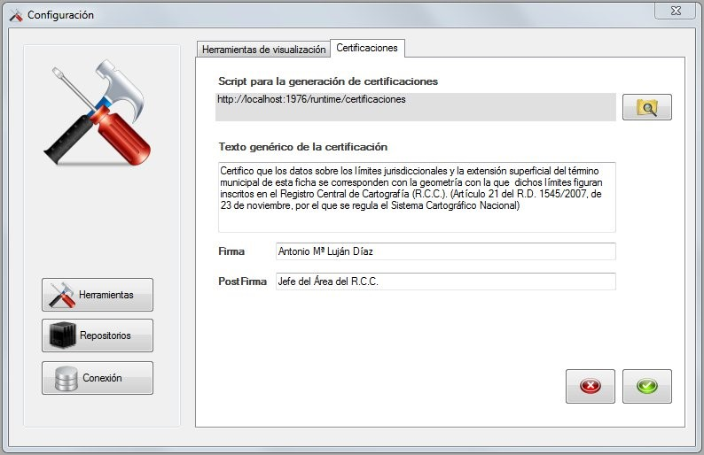

La herramienta para generar las certificaciones la encontramos en Herramientas -> Generación de certificaciones. Para acceder es necesario disponer de permisos adecuados. Contactar con el Administrador en caso de tener deshabilitada esta función.

La herramienta permite generar las certificaciones una a una, seleccionando cada vez el municipio cuya certificación se quiere obtener, o en procesos de lote, mediante dos opciones: certificaciones de una provincia o certificaciones asociadas a una versión publicada en SIGLIM.
* En el primer de los casos se generará una certificación para cada uno de los municipios de la provincia seleccionada. Las certificaciones  se guardarán en una carpeta previamente elegida por el usuario. Se nombrarán con el código INE del municipio y su nombre oficial.
* En el segundo de los casos, se elegirá una de las versiones de actualización publicadas en el SIGLIM. El procedimiento evaluará que municipios se han visto afectados por esa edición, y se generará una certificación para cada uno de ellos.

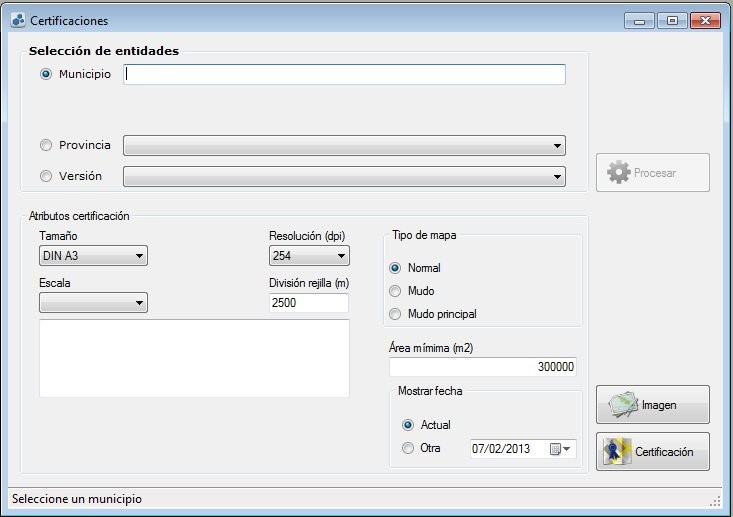

El mapa generado comprende la extensión del término municipal del municipio seleccionado identificado por un color gris, con su código INE sobre su superficie. Se encuentra rodeado de los territorios correspondientes a los municipios con los que tiene deslindes en común, identificados también por su código INE.

Las comunidades jurisdiccionales, al carecer de código INE, aparecen sin nombrar sobre el mapa. En el listado de territorios colindantes, la comunidad aparecerá al final de la lista identificada con un número secuencial entre paréntesis, de manera que el usuario puede editar el PDF e insertarlo.

En el mapa generado se etiquetan todos los recintos afectados cuya superficie sea superior a las 300000 m2. Si queremos que se introduzcan textos sobre recintos de área menor, podemos  cambiar el parámetro de área mínima introduciendo el valor del área en metros cuadrados por debajo de la cual el recinto no estará identificado su texto correspondiente. Esto es útil para casos en los que se representan grandes zonas de cartografía a pequeña escala en donde hay muchos territorios de pequeño tamaño, y su identificación resulta confusa.  Para pintar textos en todos los recintos, poner el valor a cero.

En ocasiones el proceso de generación del mapa no sitúa los textos en el lugar idóneo para el usuario. Para ello existen otras dos versiones del mapa, una en la que no figura ningún código INE sobre el mapa y una en la que n o figura el código INE del municipio principal. De esta manera puede editarse con posterioridad el PDF, ubicándose a voluntad la ubicación de los textos.

En el proceso en el que se genera individualmente una certificación para un municipio, es posible elegir el tamaño y la escala a la que se generará el documento. También podemos seleccionar el paso de malla de la rejilla de coordenadas que acompaña a la imagen. Inicialmente el sistema buscará siempre la mejor opción para que el término municipal salga en el mapa en su totalidad. En los procesos automáticos este proceso se hará automáticamente, eligiendo el procedimiento la mejor opción para cada municipio.

Podemos también elegir la fecha que queremos figure en la firma de la certificación. En los casos en que con posterioridad se quiera editar el documento PDF, sus atributos son:

* Tamaño: DIN A3
* Resolución: 254 ppp
* Font texto: Arial tamaños 8 y 10
* Font en mapa: Arial Narrow. Principal: 96 bold. Deslindes: 48 normal

Como programas de edición se recomienda Gimp® en su versión más reciente, que permite abrir y guardar en formato PDF. Si se utiliza este programa, conviene que antes de guardar se acoplen las capas para evitar cambios en el tamaño de la fuente.

### Tablas Inspire

SIDLIM dispone de herramientas para la generación de tablas compatibles con la directiva INSPIRE a partir de los datos de trabajo. Estas herramientas pueden ejecutarse por niveles jerárquicos, de manera que si no se han producido cambios que afecten a líneas autonómicas, provinciales o estatales, puede simplemente actualizarse las capas municipales, ahorrando tiempo en el proceso.

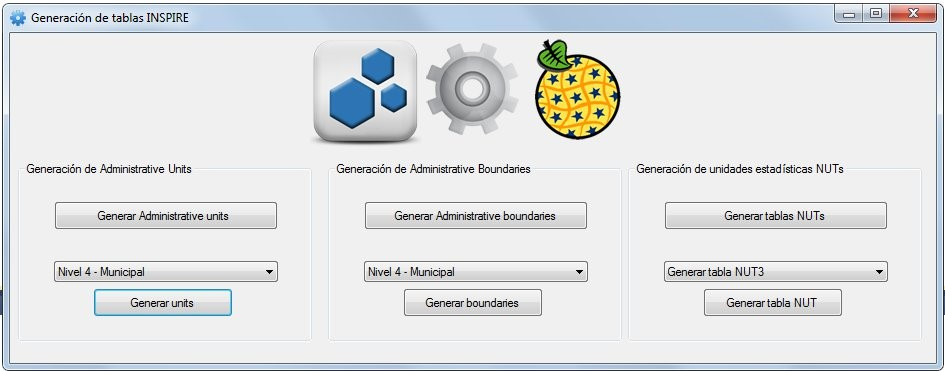

Para acceder la herramienta vamos al menú Herramientas → Procesos INSPIRE. En la ventana emergente podemos elegir entre varias opciones de actualización.

Las tablas de las unidades estadísticas, NUTs, sólo se actualizan si ha habido variaciones en los límites provinciales o autonómicos. Y en estos casos bastaría con actualizar las regiones NUT3 y NUT2.
Para que los servicios INSPIRE actualicen sus contenidos, es necesario realizar un backup de las tablas. Para ello ejecutamos:

```bash
pg_dump.exe --host sbdignmad650 --port 5432 --username "badasid" --format custom --verbose --file "D:\inspire20130620.backup" --table "geoschema.adminboundary" --table "geoschema.adminunit" --table "geoschema.nuts1" --table "geoschema.nuts2" --table "geoschema.nuts3" badasid
```
### Generación de ficheros para el centro de descargas

Periódicamente se generan los ficheros vectoriales correspondientes a las líneas límite, recintos municipales, provinciales, autonómicos y centroides de municipio para su descarga desde el Centro de Descargas del IGN. Los ficheros se generan en formato SHP en coordenadas geográficas en los sistemas de referencia ETRS89 (Península y Baleares) y WGS84 (Islas Canarias). 

Para acceder la herramienta vamos al menú Consultas → Centro de Descargas. Seleccionamos los conjuntos de datos que queremos exportar y la carpeta en donde se crearán los ficheros.

Este proceso utiliza las geometrías provinciales y autonómicas extrayendo los datos de las Tablas INSPIRE. Por eso es aconsejable, sobre todo si se han producido cambios en líneas provinciales o autonómicas, realizar primero los proceso de generación de tablas INSPIRE, para después generar los ficheros para el centro de descargas. 

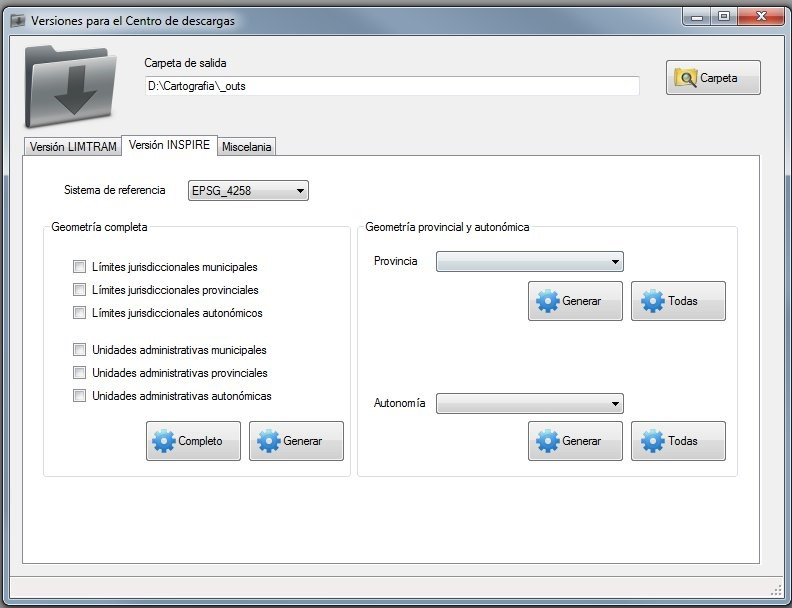


#### Script de exportación al CdD

Es necesaria la instalación del programa **pgsql2shp** para ejecutar los scripts de consulta.

```bash
::mostramos la ruta y el nombre de este bat
SET PGCLIENTENCODING=UTF-8

echo "Borramos datos"

del "C:\TrabajosLocal\ActualizacionBDLL\SIGLIM_Publico_INSPIRE\SHP_ETRS89\ll_autonomicas_inspire_peninbal_etrs89\*" /f /q /s
del "C:\TrabajosLocal\ActualizacionBDLL\SIGLIM_Publico_INSPIRE\SHP_ETRS89\ll_provinciales_inspire_peninbal_etrs89\*" /f /q /s
del "C:\TrabajosLocal\ActualizacionBDLL\SIGLIM_Publico_INSPIRE\SHP_ETRS89\ll_municipales_inspire_peninbal_etrs89\*" /f /q /s
del "C:\TrabajosLocal\ActualizacionBDLL\SIGLIM_Publico_INSPIRE\SHP_WGS84\ll_municipales_inspire_canarias_wgs84\*" /f /q /s
del "C:\TrabajosLocal\ActualizacionBDLL\SIGLIM_Publico_INSPIRE\SHP_WGS84\ll_provinciales_inspire_canarias_wgs84\*" /f /q /s
del "C:\TrabajosLocal\ActualizacionBDLL\SIGLIM_Publico_INSPIRE\SHP_WGS84\ll_autonomicas_inspire_canarias_wgs84\*" /f /q /s

del "C:\TrabajosLocal\ActualizacionBDLL\SIGLIM_Publico_INSPIRE\SHP_ETRS89\recintos_autonomicas_inspire_peninbal_etrs89\*" /f /q /s
del "C:\TrabajosLocal\ActualizacionBDLL\SIGLIM_Publico_INSPIRE\SHP_ETRS89\recintos_provinciales_inspire_peninbal_etrs89\*" /f /q /s
del "C:\TrabajosLocal\ActualizacionBDLL\SIGLIM_Publico_INSPIRE\SHP_ETRS89\recintos_municipales_inspire_peninbal_etrs89\*" /f /q /s
del "C:\TrabajosLocal\ActualizacionBDLL\SIGLIM_Publico_INSPIRE\SHP_WGS84\recintos_municipales_inspire_canarias_wgs84\*" /f /q /s
del "C:\TrabajosLocal\ActualizacionBDLL\SIGLIM_Publico_INSPIRE\SHP_WGS84\recintos_provinciales_inspire_canarias_wgs84\*" /f /q /s
del "C:\TrabajosLocal\ActualizacionBDLL\SIGLIM_Publico_INSPIRE\SHP_WGS84\recintos_autonomicas_inspire_canarias_wgs84\*" /f /q /s

echo "Ejecutamos exportación a SHP de las AdminBoundaries"

::Líneas municipales Península y Baleares
pgsql2shp -f "C:\TrabajosLocal\ActualizacionBDLL\SIGLIM_Publico_INSPIRE\SHP_ETRS89\ll_municipales_inspire_peninbal_etrs89\ll_municipales_inspire_peninbal_etrs89.shp" -h 10.13.90.22 -u cartocon -P cartopass badasid "select 'ES.IGN.BDDAE.' || nationalcode as inspireid,nationalcode,country,nationallevel as natlev,nationallevelname as natlevname,legalstatus as legstatus,accuracy,name_boundary,date_boundary,url_resource,adminboundary.the_geom from adminboundary where nationallevel = 'https://inspire.ec.europa.eu/codelist/AdministrativeHierarchyLevel/4thOrder' and ST_YMax(adminboundary.the_geom)>32"
::Líneas municipales Canarias
pgsql2shp -f "C:\TrabajosLocal\ActualizacionBDLL\SIGLIM_Publico_INSPIRE\SHP_WGS84\ll_municipales_inspire_canarias_wgs84\ll_municipales_inspire_canarias_wgs84.shp" -h 10.13.90.22 -u cartocon -P cartopass badasid "select 'ES.IGN.BDDAE.' || nationalcode as inspireid,nationalcode,country,nationallevel as natlev,nationallevelname as natlevname,legalstatus as legstatus,accuracy,name_boundary,date_boundary,url_resource,ST_Transform(adminboundary.the_geom,4326) as the_geom from adminboundary where nationallevel = 'https://inspire.ec.europa.eu/codelist/AdministrativeHierarchyLevel/4thOrder' and ST_YMax(adminboundary.the_geom)<32"
::Líneas provinciales Península y Baleares
pgsql2shp -f "C:\TrabajosLocal\ActualizacionBDLL\SIGLIM_Publico_INSPIRE\SHP_ETRS89\ll_provinciales_inspire_peninbal_etrs89\ll_provinciales_inspire_peninbal_etrs89.shp" -h 10.13.90.22 -u cartocon -P cartopass badasid "select 'ES.IGN.BDDAE.' || nationalcode as inspireid,nationalcode,country,nationallevel as natlev,nationallevelname as natlevname,legalstatus as legstatus,accuracy,name_boundary,date_boundary,url_resource,adminboundary.the_geom from adminboundary where nationallevel= 'https://inspire.ec.europa.eu/codelist/AdministrativeHierarchyLevel/3rdOrder' and ST_YMax(adminboundary.the_geom)>32"
::Líneas provinciales Canarias
pgsql2shp -f "C:\TrabajosLocal\ActualizacionBDLL\SIGLIM_Publico_INSPIRE\SHP_WGS84\ll_provinciales_inspire_canarias_wgs84\ll_provinciales_inspire_canarias_wgs84.shp" -h 10.13.90.22 -u cartocon -P cartopass badasid "select 'ES.IGN.BDDAE.' || nationalcode as inspireid,nationalcode,country,nationallevel as natlev,nationallevelname as natlevname,legalstatus as legstatus,accuracy,name_boundary,date_boundary,url_resource,ST_Transform(adminboundary.the_geom,4326) as the_geom from adminboundary where nationallevel= 'https://inspire.ec.europa.eu/codelist/AdministrativeHierarchyLevel/3rdOrder' and ST_YMax(adminboundary.the_geom)<32"
::Líneas autonómicas Península y Baleares
pgsql2shp -f "C:\TrabajosLocal\ActualizacionBDLL\SIGLIM_Publico_INSPIRE\SHP_ETRS89\ll_autonomicas_inspire_peninbal_etrs89\ll_autonomicas_inspire_peninbal_etrs89.shp" -h 10.13.90.22 -u cartocon -P cartopass badasid "select 'ES.IGN.BDDAE.' || nationalcode as inspireid,nationalcode,country,nationallevel as natlev,nationallevelname as natlevname,legalstatus as legstatus,accuracy,name_boundary,date_boundary,url_resource,adminboundary.the_geom from adminboundary where nationallevel = 'https://inspire.ec.europa.eu/codelist/AdministrativeHierarchyLevel/2ndOrder' and ST_YMax(adminboundary.the_geom)>32"
::Líneas autonómicas Canarias
pgsql2shp -f "C:\TrabajosLocal\ActualizacionBDLL\SIGLIM_Publico_INSPIRE\SHP_WGS84\ll_autonomicas_inspire_canarias_wgs84\ll_autonomicas_inspire_canarias_wgs84.shp" -h 10.13.90.22 -u cartocon -P cartopass badasid "select 'ES.IGN.BDDAE.' || nationalcode as inspireid,nationalcode,country,nationallevel as natlev,nationallevelname as natlevname,legalstatus as legstatus,accuracy,name_boundary,date_boundary,url_resource,ST_Transform(adminboundary.the_geom,4326) as the_geom from adminboundary where nationallevel = 'https://inspire.ec.europa.eu/codelist/AdministrativeHierarchyLevel/2ndOrder' and ST_YMax(adminboundary.the_geom)<32"

echo "Ejecutamos exportación a SHP de las AdminUnits"

::Recintos municipales Península y Baleares
pgsql2shp -f "C:\TrabajosLocal\ActualizacionBDLL\SIGLIM_Publico_INSPIRE\SHP_ETRS89\recintos_municipales_inspire_peninbal_etrs89\recintos_municipales_inspire_peninbal_etrs89.shp" -h 10.13.90.22 -u cartocon -P cartopass badasid "select 'ES.IGN.BDDAE.' || nationalcode as inspireid,country,nationallevel as natlev,nationallevelname as natlevname,nationalcode as natcode,nameunit,codnut1,codnut2,codnut3,adminunit.the_geom from adminunit where nationallevel = 'https://inspire.ec.europa.eu/codelist/AdministrativeHierarchyLevel/4thOrder' and ST_YMax(adminunit.the_geom)>32"
::Recintos municipales Canarias
pgsql2shp -f "C:\TrabajosLocal\ActualizacionBDLL\SIGLIM_Publico_INSPIRE\SHP_WGS84\recintos_municipales_inspire_canarias_wgs84\recintos_municipales_inspire_canarias_wgs84.shp" -h 10.13.90.22 -u cartocon -P cartopass badasid "select 'ES.IGN.BDDAE.' || nationalcode as inspireid,country,nationallevel as natlev,nationallevelname as natlevname,nationalcode as natcode,nameunit,codnut1,codnut2,codnut3,ST_Transform(adminunit.the_geom,4326) as the_geom from adminunit where nationallevel = 'https://inspire.ec.europa.eu/codelist/AdministrativeHierarchyLevel/4thOrder' and ST_YMax(adminunit.the_geom)<32"
::Recintos provinciales Península y Baleares
pgsql2shp -f "C:\TrabajosLocal\ActualizacionBDLL\SIGLIM_Publico_INSPIRE\SHP_ETRS89\recintos_provinciales_inspire_peninbal_etrs89\recintos_provinciales_inspire_peninbal_etrs89.shp" -h 10.13.90.22 -u cartocon -P cartopass badasid "select 'ES.IGN.BDDAE.' || nationalcode as inspireid,country,nationallevel as natlev,nationallevelname as natlevname,nationalcode as natcode,nameunit,codnut1,codnut2,codnut3,adminunit.the_geom from adminunit where nationallevel = 'https://inspire.ec.europa.eu/codelist/AdministrativeHierarchyLevel/3rdOrder' and ST_YMax(adminunit.the_geom)>32"
::Recintos provinciales Canarias
pgsql2shp -f "C:\TrabajosLocal\ActualizacionBDLL\SIGLIM_Publico_INSPIRE\SHP_WGS84\recintos_provinciales_inspire_canarias_wgs84\recintos_provinciales_inspire_canarias_wgs84.shp" -h 10.13.90.22 -u cartocon -P cartopass badasid "select 'ES.IGN.BDDAE.' || nationalcode as inspireid,country,nationallevel as natlev,nationallevelname as natlevname,nationalcode as natcode,nameunit,codnut1,codnut2,codnut3,ST_Transform(adminunit.the_geom,4326) as the_geom from adminunit where nationallevel = 'https://inspire.ec.europa.eu/codelist/AdministrativeHierarchyLevel/3rdOrder' and ST_YMax(adminunit.the_geom)<32"
::Recintos autonómicos Península y Baleares
pgsql2shp -f "C:\TrabajosLocal\ActualizacionBDLL\SIGLIM_Publico_INSPIRE\SHP_ETRS89\recintos_autonomicas_inspire_peninbal_etrs89\recintos_autonomicas_inspire_peninbal_etrs89.shp" -h 10.13.90.22 -u cartocon -P cartopass badasid "select 'ES.IGN.BDDAE.' || nationalcode as inspireid,country,nationallevel as natlev,nationallevelname as natlevname,nationalcode as natcode,nameunit,codnut1,codnut2,codnut3,adminunit.the_geom from adminunit where nationallevel = 'https://inspire.ec.europa.eu/codelist/AdministrativeHierarchyLevel/2ndOrder' and ST_YMax(adminunit.the_geom)>32"
::Recintos autonómicos Canarias
pgsql2shp -f "C:\TrabajosLocal\ActualizacionBDLL\SIGLIM_Publico_INSPIRE\SHP_WGS84\recintos_autonomicas_inspire_canarias_wgs84\recintos_autonomicas_inspire_canarias_wgs84.shp" -h 10.13.90.22 -u cartocon -P cartopass badasid "select 'ES.IGN.BDDAE.' || nationalcode as inspireid,country,nationallevel as natlev,nationallevelname as natlevname,nationalcode as natcode,nameunit,codnut1,codnut2,codnut3,ST_Transform(adminunit.the_geom,4326) as the_geom from adminunit where nationallevel = 'https://inspire.ec.europa.eu/codelist/AdministrativeHierarchyLevel/2ndOrder' and ST_YMax(adminunit.the_geom)<32"


echo "Exportación terminada"
```


