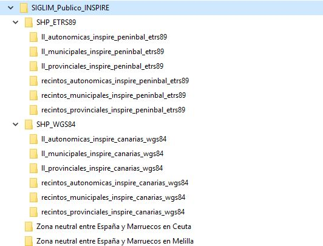

# Procedimiento de generación de ficheros SHP para el CdD

Una vez que hemos regenerado las tablas *AdminBoundary* y *AdminUnits* del **BADASID**, podemos ejecutar este procedimiento para la exportación de la **BDDAE** al CdD para su distribución mediante ficheros *shapefile*.

La estructura de ficheros que necesita el script es la siguiente



Las carpetas **Zona neutral entre España y Marruecos en Ceuta** y **Zona neutral entre España y Marruecos en Melilla** no sufern alteración, ya que el contenido no varía entre versiones. Además complementan la actualización los ficheros

* 📝 20190208MetadatosDivisionesAdministrativas.xml
* 📝 Leeme BDDAE.pdf

Hay un tercer fichero con el listado de líneas que varían que añade Mercedes.

Cuando se ejecuta el script, se elm,inan los centenidos que varían de una entrega a otra y se reemplazan por la nueva exportación. El script para la generación de este producto es el siguiente:

```bash
::mostramos la ruta y el nombre de este bat
SET PGCLIENTENCODING=UTF-8

echo "Borramos datos"

del "C:\TrabajosLocal\ActualizacionBDLL\SIGLIM_Publico_INSPIRE\SHP_ETRS89\ll_autonomicas_inspire_peninbal_etrs89\*" /f /q /s
del "C:\TrabajosLocal\ActualizacionBDLL\SIGLIM_Publico_INSPIRE\SHP_ETRS89\ll_provinciales_inspire_peninbal_etrs89\*" /f /q /s
del "C:\TrabajosLocal\ActualizacionBDLL\SIGLIM_Publico_INSPIRE\SHP_ETRS89\ll_municipales_inspire_peninbal_etrs89\*" /f /q /s
del "C:\TrabajosLocal\ActualizacionBDLL\SIGLIM_Publico_INSPIRE\SHP_WGS84\ll_municipales_inspire_canarias_wgs84\*" /f /q /s
del "C:\TrabajosLocal\ActualizacionBDLL\SIGLIM_Publico_INSPIRE\SHP_WGS84\ll_provinciales_inspire_canarias_wgs84\*" /f /q /s
del "C:\TrabajosLocal\ActualizacionBDLL\SIGLIM_Publico_INSPIRE\SHP_WGS84\ll_autonomicas_inspire_canarias_wgs84\*" /f /q /s

del "C:\TrabajosLocal\ActualizacionBDLL\SIGLIM_Publico_INSPIRE\SHP_ETRS89\recintos_autonomicas_inspire_peninbal_etrs89\*" /f /q /s
del "C:\TrabajosLocal\ActualizacionBDLL\SIGLIM_Publico_INSPIRE\SHP_ETRS89\recintos_provinciales_inspire_peninbal_etrs89\*" /f /q /s
del "C:\TrabajosLocal\ActualizacionBDLL\SIGLIM_Publico_INSPIRE\SHP_ETRS89\recintos_municipales_inspire_peninbal_etrs89\*" /f /q /s
del "C:\TrabajosLocal\ActualizacionBDLL\SIGLIM_Publico_INSPIRE\SHP_WGS84\recintos_municipales_inspire_canarias_wgs84\*" /f /q /s
del "C:\TrabajosLocal\ActualizacionBDLL\SIGLIM_Publico_INSPIRE\SHP_WGS84\recintos_provinciales_inspire_canarias_wgs84\*" /f /q /s
del "C:\TrabajosLocal\ActualizacionBDLL\SIGLIM_Publico_INSPIRE\SHP_WGS84\recintos_autonomicas_inspire_canarias_wgs84\*" /f /q /s

echo "Ejecutamos exportación a SHP de las AdminBoundaries"

::Líneas municipales Península y Baleares
pgsql2shp -f "C:\TrabajosLocal\ActualizacionBDLL\SIGLIM_Publico_INSPIRE\SHP_ETRS89\ll_municipales_inspire_peninbal_etrs89\ll_municipales_inspire_peninbal_etrs89.shp" -h 10.13.90.22 -u cartocon -P cartopass badasid "select 'ES.IGN.BDDAE.' || nationalcode as inspireid,nationalcode,country,nationallevel as natlev,nationallevelname as natlevname,legalstatus as legstatus,accuracy,name_boundary,date_boundary,url_resource,adminboundary.the_geom from adminboundary where nationallevel = 'https://inspire.ec.europa.eu/codelist/AdministrativeHierarchyLevel/4thOrder' and ST_YMax(adminboundary.the_geom)>32"
::Líneas municipales Canarias
pgsql2shp -f "C:\TrabajosLocal\ActualizacionBDLL\SIGLIM_Publico_INSPIRE\SHP_WGS84\ll_municipales_inspire_canarias_wgs84\ll_municipales_inspire_canarias_wgs84.shp" -h 10.13.90.22 -u cartocon -P cartopass badasid "select 'ES.IGN.BDDAE.' || nationalcode as inspireid,nationalcode,country,nationallevel as natlev,nationallevelname as natlevname,legalstatus as legstatus,accuracy,name_boundary,date_boundary,url_resource,ST_Transform(adminboundary.the_geom,4326) as the_geom from adminboundary where nationallevel = 'https://inspire.ec.europa.eu/codelist/AdministrativeHierarchyLevel/4thOrder' and ST_YMax(adminboundary.the_geom)<32"
::Líneas provinciales Península y Baleares
pgsql2shp -f "C:\TrabajosLocal\ActualizacionBDLL\SIGLIM_Publico_INSPIRE\SHP_ETRS89\ll_provinciales_inspire_peninbal_etrs89\ll_provinciales_inspire_peninbal_etrs89.shp" -h 10.13.90.22 -u cartocon -P cartopass badasid "select 'ES.IGN.BDDAE.' || nationalcode as inspireid,nationalcode,country,nationallevel as natlev,nationallevelname as natlevname,legalstatus as legstatus,accuracy,name_boundary,date_boundary,url_resource,adminboundary.the_geom from adminboundary where nationallevel= 'https://inspire.ec.europa.eu/codelist/AdministrativeHierarchyLevel/3rdOrder' and ST_YMax(adminboundary.the_geom)>32"
::Líneas provinciales Canarias
pgsql2shp -f "C:\TrabajosLocal\ActualizacionBDLL\SIGLIM_Publico_INSPIRE\SHP_WGS84\ll_provinciales_inspire_canarias_wgs84\ll_provinciales_inspire_canarias_wgs84.shp" -h 10.13.90.22 -u cartocon -P cartopass badasid "select 'ES.IGN.BDDAE.' || nationalcode as inspireid,nationalcode,country,nationallevel as natlev,nationallevelname as natlevname,legalstatus as legstatus,accuracy,name_boundary,date_boundary,url_resource,ST_Transform(adminboundary.the_geom,4326) as the_geom from adminboundary where nationallevel= 'https://inspire.ec.europa.eu/codelist/AdministrativeHierarchyLevel/3rdOrder' and ST_YMax(adminboundary.the_geom)<32"
::Líneas autonómicas Península y Baleares
pgsql2shp -f "C:\TrabajosLocal\ActualizacionBDLL\SIGLIM_Publico_INSPIRE\SHP_ETRS89\ll_autonomicas_inspire_peninbal_etrs89\ll_autonomicas_inspire_peninbal_etrs89.shp" -h 10.13.90.22 -u cartocon -P cartopass badasid "select 'ES.IGN.BDDAE.' || nationalcode as inspireid,nationalcode,country,nationallevel as natlev,nationallevelname as natlevname,legalstatus as legstatus,accuracy,name_boundary,date_boundary,url_resource,adminboundary.the_geom from adminboundary where nationallevel = 'https://inspire.ec.europa.eu/codelist/AdministrativeHierarchyLevel/2ndOrder' and ST_YMax(adminboundary.the_geom)>32"
::Líneas autonómicas Canarias
pgsql2shp -f "C:\TrabajosLocal\ActualizacionBDLL\SIGLIM_Publico_INSPIRE\SHP_WGS84\ll_autonomicas_inspire_canarias_wgs84\ll_autonomicas_inspire_canarias_wgs84.shp" -h 10.13.90.22 -u cartocon -P cartopass badasid "select 'ES.IGN.BDDAE.' || nationalcode as inspireid,nationalcode,country,nationallevel as natlev,nationallevelname as natlevname,legalstatus as legstatus,accuracy,name_boundary,date_boundary,url_resource,ST_Transform(adminboundary.the_geom,4326) as the_geom from adminboundary where nationallevel = 'https://inspire.ec.europa.eu/codelist/AdministrativeHierarchyLevel/2ndOrder' and ST_YMax(adminboundary.the_geom)<32"

echo "Ejecutamos exportación a SHP de las AdminUnits"

::Recintos municipales Península y Baleares
pgsql2shp -f "C:\TrabajosLocal\ActualizacionBDLL\SIGLIM_Publico_INSPIRE\SHP_ETRS89\recintos_municipales_inspire_peninbal_etrs89\recintos_municipales_inspire_peninbal_etrs89.shp" -h 10.13.90.22 -u cartocon -P cartopass badasid "select 'ES.IGN.BDDAE.' || nationalcode as inspireid,country,nationallevel as natlev,nationallevelname as natlevname,nationalcode as natcode,nameunit,codnut1,codnut2,codnut3,adminunit.the_geom from adminunit where nationallevel = 'https://inspire.ec.europa.eu/codelist/AdministrativeHierarchyLevel/4thOrder' and ST_YMax(adminunit.the_geom)>32"
::Recintos municipales Canarias
pgsql2shp -f "C:\TrabajosLocal\ActualizacionBDLL\SIGLIM_Publico_INSPIRE\SHP_WGS84\recintos_municipales_inspire_canarias_wgs84\recintos_municipales_inspire_canarias_wgs84.shp" -h 10.13.90.22 -u cartocon -P cartopass badasid "select 'ES.IGN.BDDAE.' || nationalcode as inspireid,country,nationallevel as natlev,nationallevelname as natlevname,nationalcode as natcode,nameunit,codnut1,codnut2,codnut3,ST_Transform(adminunit.the_geom,4326) as the_geom from adminunit where nationallevel = 'https://inspire.ec.europa.eu/codelist/AdministrativeHierarchyLevel/4thOrder' and ST_YMax(adminunit.the_geom)<32"
::Recintos provinciales Península y Baleares
pgsql2shp -f "C:\TrabajosLocal\ActualizacionBDLL\SIGLIM_Publico_INSPIRE\SHP_ETRS89\recintos_provinciales_inspire_peninbal_etrs89\recintos_provinciales_inspire_peninbal_etrs89.shp" -h 10.13.90.22 -u cartocon -P cartopass badasid "select 'ES.IGN.BDDAE.' || nationalcode as inspireid,country,nationallevel as natlev,nationallevelname as natlevname,nationalcode as natcode,nameunit,codnut1,codnut2,codnut3,adminunit.the_geom from adminunit where nationallevel = 'https://inspire.ec.europa.eu/codelist/AdministrativeHierarchyLevel/3rdOrder' and ST_YMax(adminunit.the_geom)>32"
::Recintos provinciales Canarias
pgsql2shp -f "C:\TrabajosLocal\ActualizacionBDLL\SIGLIM_Publico_INSPIRE\SHP_WGS84\recintos_provinciales_inspire_canarias_wgs84\recintos_provinciales_inspire_canarias_wgs84.shp" -h 10.13.90.22 -u cartocon -P cartopass badasid "select 'ES.IGN.BDDAE.' || nationalcode as inspireid,country,nationallevel as natlev,nationallevelname as natlevname,nationalcode as natcode,nameunit,codnut1,codnut2,codnut3,ST_Transform(adminunit.the_geom,4326) as the_geom from adminunit where nationallevel = 'https://inspire.ec.europa.eu/codelist/AdministrativeHierarchyLevel/3rdOrder' and ST_YMax(adminunit.the_geom)<32"
::Recintos autonómicos Península y Baleares
pgsql2shp -f "C:\TrabajosLocal\ActualizacionBDLL\SIGLIM_Publico_INSPIRE\SHP_ETRS89\recintos_autonomicas_inspire_peninbal_etrs89\recintos_autonomicas_inspire_peninbal_etrs89.shp" -h 10.13.90.22 -u cartocon -P cartopass badasid "select 'ES.IGN.BDDAE.' || nationalcode as inspireid,country,nationallevel as natlev,nationallevelname as natlevname,nationalcode as natcode,nameunit,codnut1,codnut2,codnut3,adminunit.the_geom from adminunit where nationallevel = 'https://inspire.ec.europa.eu/codelist/AdministrativeHierarchyLevel/2ndOrder' and ST_YMax(adminunit.the_geom)>32"
::Recintos autonómicos Canarias
pgsql2shp -f "C:\TrabajosLocal\ActualizacionBDLL\SIGLIM_Publico_INSPIRE\SHP_WGS84\recintos_autonomicas_inspire_canarias_wgs84\recintos_autonomicas_inspire_canarias_wgs84.shp" -h 10.13.90.22 -u cartocon -P cartopass badasid "select 'ES.IGN.BDDAE.' || nationalcode as inspireid,country,nationallevel as natlev,nationallevelname as natlevname,nationalcode as natcode,nameunit,codnut1,codnut2,codnut3,ST_Transform(adminunit.the_geom,4326) as the_geom from adminunit where nationallevel = 'https://inspire.ec.europa.eu/codelist/AdministrativeHierarchyLevel/2ndOrder' and ST_YMax(adminunit.the_geom)<32"


echo "Exportación terminada"
```

El resultado final se comprime en ZIP con el nombre CdD_[Fecha en formato ISO8601] y se copia a la carpeta \\sbdignmad800\RCC_COMPARTIDA\C_DELIMITACIONES_TERRITORIALES. 