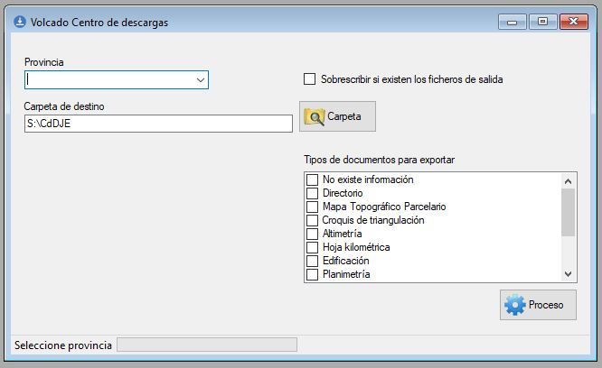

# Bitácora

📂 _e2molin-documentacion-cartosee.md

## ⏳ 20200721 - Ficheros preparados para su entrega al CdD

Se han generado los ficheros de los documentos producidos por la Junta General de Estadística correspondientes a los siguientes grupos:

* Hojas kilométricas
* Parcelario urbano de la JE
* Directorios

en la carpeta

```bash
\\sbdignmad651.ign.fomento.es\INTERCAMBIO\User_Esteban\CdDJE
```

## ⏳ 20200701 - Procedimiento actualizado para la exportación al CdD - Documentos de la JGE



* La interfaz permite preparar los documentos para el CdD de una provincia o de todas a la vez.
* Pueden seleccionarse los documentos por su tipología
* Genera la siguiente estructura de ficheros

```bash
/
├── 📁 documentos         # Estructura con los ficheros renombrados
    ├── 📁 01             # Álava
    ├── 📁 02             # Álbacete
    ├── 📁 ....
    ├── 📁 50               # Zaragoza
├── actualizCartoSEE.sql    # Sentencias SQL para consolidar la expostacioón al CdD
├── alias.txt               # Metadatos de cada fichero
├── logCopy.log             # Logger del proceso de copia
├── municipios.txt          # Asociación de ficheros a los municipios
```
* Los documentos que no se puede copiar (generalmente xq no existe el ficgero de origen) se muestran en el fichero log de copia.
* Cuando un documento no dispone de fecha, aparece con el texto genérico **Sin fecha**.
* Fichero alias.txt
  * Encabezados: idProductor Fichero Temática Alias Fecha TipoFichero
  * El *idproductor* es elnúmero de sellado (seis dígitos con ceros a la izquierda).
  * El fichero se compone del prefijo definido en la tabla *bdsidschema.tbtipodocumento*, un guión bajo y el número de sellado
  * La Temática es el nombre del tipo de documento según tabla *bdsidschema.tbtipodocumento*.
  * El alias varía en función del tipo de documento. Ver apartado 👇
* Fichero municipios.txt
  * Encabezados: idProductor Nombre Fichero JPG Códigos INE de municipio asociado
  * Como código INE se utiliza el mismo que en la BDLL, esto es 34AAPPMMMMM (Autonomía, Provincia, Municipio)
  * Se concatena tanto el idProductor como el nombre del fichero, lo que les sea más fácil.
* 👀❗️❗️ Aunque los documentos se muestran agrupados por provincia, al CdD se les entragan todos en una única carpeta.

### 🔸 Estructura del Alias

Entendemos que en el panel de resultados que muestra el CdD, la descripción que aparecerá al usuario tendrá la estructura: Temática – Alias.

* Hoja kilométrica **HOJKM**: 
  * Estructura → nº XXXXXX. Municipio histórico (Municipio Actual). Año. Colección X: Subdivisión
  * Ejemplo 1 → nº 280505. Carabanchel Alto (Madrid). 1860. Colección 1: B6
  * Ejemplo 2 → nº 280823. Majadahonda. 1860. Colección única: 2H
* Parcelario urbano **PAURB**:
  * Estructura → nº XXXXXX. Municipio histórico (Municipio Actual). Año. Colección X. Subdivisión
  * Ejemplo 1 → nº 280505. Hortaleza (Madrid). 1860. Colección única: Sec 1
  * Ejemplo 2 → nº 280823. Boadilla del Monte. 1860. Colección única
* Directores **DIREC**:
  * Estructura → nº XXXXXX. Municipio histórico (Municipio Actual). Año. Colección X
  * Ejemplo 1 → nº 280652. Hortaleza (Madrid). 1860. Colección única
  * Ejemplo 2 → nº 284578. Boadilla del Monte. 1860. Colección única


## ⏳ 20200628 - Procedimiento de depuración de subtipos y colecciones 

Hemos creado dos columnas, **newcol** y **newsubtipo** en *bdsidschema.tbtipodocumento* para prooner alternativas a los campos existentes.

## ⏳ 20200520 - Informe de documentos sin contorno

Con esta SQL obtengo los contornos para Maria José

```sql
select tbtipodocumento.tipodoc,archivo.subtipo, numdoc as sellado,signatura
from archivo 
inner join tbtipodocumento on archivo.tipodoc_id=tbtipodocumento.idtipodoc
where cdd_producto = 'Planimetrías, Altimetrías y Conjuntas' and cdd_geometria=0 
and archivo.idarchivo not in (select archivo_id from bdsidschema.contornos)
```

Lo envío en un excel para ver qué hacemos: 📂 Documentos CartoSEE sin contornos.xlsx


## ⏳ 20200519 - Reunión para comentar informe

* Hablar con el CdD y comentarles que les vamos a generar de nuevo toda la documentación, con los títulos corregidos y las asociaciones de contornos corregidas. Tiene sentido plantearlo porque desde 2017 se han corregido una gran cantidad de documentos, y no tenemos hasta ahora un control de versiones. Además, los datos que en aquella ocasión se suministraron eran de acuerdo a la limitaciones del CdD anterior, y la información asociada a los documentos no podía ser más completa. 
* Implementar el control de versiones.
* Generar todos los contornos que faltan.
* Generar los ficheros desde cero, como hicimos en 2020 con las Actas y Cuadernos.


## ⏳ 20200505 - Informe
En el documento  mostramos el informe de la situación de los documentos a descarga en el CdD. En [esta web](https://www.notion.so/Situaci-n-GEODOCAT-en-CdD-91ab7c973f5943ba9cd242ae47809e4c) se puede consultar.

## ⏳ 20210421 - Documentos CartoSEE en CdD

Solicitamos al CdD una lista de los documentos de CartoSEE puestos a descargas.